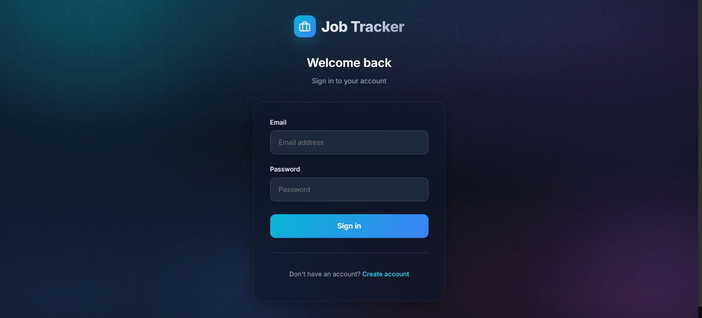
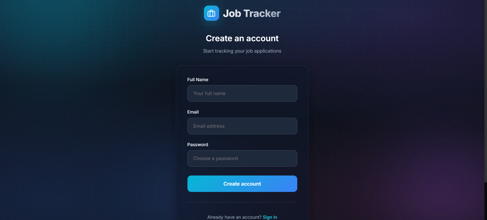

# Job Application Tracker

A full-stack job application tracking app built with Next.js 16, React 19, and MongoDB. Track every application from "Applied" to "Offer" (or "Rejected"), visualize your pipeline with charts, and reflect on your interview experiences.

**Live Demo:** [job-tracker-rho-ruddy.vercel.app](https://job-tracker-rho-ruddy.vercel.app/)


---

## What This Project Does

You're job hunting. You've applied to dozens of companies. Some ghosted you, some sent online assessments, a few scheduled interviews — and you can't remember which ones.

**This app is your job hunting command center.**

- **Track every application** with company, role, status, and dates
- **Visual dashboard** with stats cards showing counts by status
- **Charts** — bar and pie charts to visualize your pipeline
- **Inline editing** — update any application directly from the table
- **Reflection & feedback** — record what went well, what didn't, and lessons learned
- **Auth** — email/password signup and login with hashed passwords

---

## Screenshots

| Login | Signup |
|-------|--------|
|  |  |

| | | |
|---|---|---|
|  |  |  |

---

## Tech Stack

| Layer | Technology | Why |
|-------|-----------|-----|
| Framework | Next.js 16 (App Router) | File-based routing, API routes, and frontend in one project |
| Frontend | React 19 | Component model, hooks, client-side interactivity |
| Charts | Recharts | Declarative, React-native charting — a pie chart is 3 lines |
| Database | MongoDB + Mongoose | JSON-like documents, schema flexibility, perfect for simple data |
| Auth | bcryptjs | Industry-standard password hashing, never stores plain text |
| Language | TypeScript | Catches bugs before they happen (saved us from the `undefined percent` crash) |
| Styling | Inline styles + Tailwind CSS | Glassmorphism effects, animated backgrounds, responsive grids |
| Deployment | Vercel | Zero-config deployment for Next.js |

---

## Architecture

```
┌─────────────────────────────────────────────────────────────────┐
│                       JOB APP TRACKER                           │
├─────────────────────────────────────────────────────────────────┤
│                                                                 │
│   ┌──────────────┐     ┌──────────────┐     ┌──────────────┐   │
│   │   FRONTEND   │────>│   API LAYER  │────>│   DATABASE   │   │
│   │   (React)    │<────│  (Next.js)   │<────│  (MongoDB)   │   │
│   └──────────────┘     └──────────────┘     └──────────────┘   │
│                                                                 │
│   Dashboard, Forms,    Route handlers       Mongoose models     │
│   Charts, Auth UI      for CRUD + Auth      User & Job data    │
│                                                                 │
└─────────────────────────────────────────────────────────────────┘
```

### How a Request Flows

```
User fills the Add Job form
        │
        ▼
POST /api/jobs — API route receives the request
        │
        ▼
connectDB() — reuses cached MongoDB connection
        │
        ▼
Job.create() — Mongoose saves the document
        │
        ▼
Response → Frontend updates the job list
```

### Project Structure

```
app/
├── api/
│   ├── auth/signup/route.ts   # POST — create account
│   ├── login/route.ts         # POST — authenticate
│   └── jobs/
│       ├── route.ts           # GET, POST, PUT, DELETE
│       └── stats/route.ts     # GET — aggregated counts
├── dashboard/page.tsx         # Main dashboard
├── login/page.tsx             # Login page
├── signup/page.tsx            # Signup page
└── page.tsx                   # Root redirect

components/
├── charts/                    # Bar chart, pie chart, reflections
├── jobs/                      # Add job form, job list table
└── ui/                        # Reusable components (shadcn/ui)

models/
├── User.ts                    # name, email, hashed password
└── Job.ts                     # company, role, status, dates, feedback

lib/
└── db.ts                      # MongoDB connection with caching
```

---

## Technical Challenges Solved

### 1. MongoDB Connection Exhaustion in Serverless

**Problem:** In serverless environments (Vercel), every API request can spin up a fresh instance. Each instance creates a new database connection → connection pool exhausted.

**Solution:** Cache the connection on the `global` object so it survives across requests:

```typescript
let cached = (global as any).mongoose;
if (!cached) {
  cached = (global as any).mongoose = { conn: null, promise: null };
}

export default async function connectDB() {
  if (cached.conn) return cached.conn;
  if (!cached.promise) {
    cached.promise = mongoose.connect(MONGODB_URI);
  }
  cached.conn = await cached.promise;
  return cached.conn;
}
```

One connection, reused across all requests.

---

### 2. Mongoose Model Overwrite on Hot Reload

**Problem:** `OverwriteModelError: Cannot overwrite 'User' model once compiled` — Next.js hot reloads re-execute model files, trying to register the same model twice.

**Solution:** Check if the model already exists before creating:

```typescript
const User = mongoose.models.User || mongoose.model<IUser>("User", UserSchema);
```

---

### 3. localStorage on the Server

**Problem:** The root page tried to read `localStorage` to decide where to redirect — but Next.js renders on the server first, where `localStorage` doesn't exist. Blank page.

**Solution:** Mark as client component and defer to `useEffect`:

```typescript
"use client";

useEffect(() => {
  const user = localStorage.getItem("jat_user");
  if (user) router.replace("/dashboard");
  else router.replace("/login");
}, []);
```

Browser-only APIs must run in browser-only lifecycle hooks.

---

### 4. TypeScript Catching an Undefined Crash

**Problem:** Recharts passes `percent` to the pie chart label function, but it can be `undefined`. Without handling, `undefined * 100` = `NaN` displayed on the chart.

**Solution:** Nullish coalescing:

```typescript
label={({ name, percent }) => `${name} ${((percent ?? 0) * 100).toFixed(0)}%`}
```

TypeScript flagged this before any user saw a broken chart.

---

### 5. Leaking Password Hashes in API Responses

**Problem:** Returning the full user object from the login API exposed the hashed password to the frontend.

**Solution:** Return only what's needed:

```typescript
return Response.json({
  ok: true,
  user: { name: user.name, email: user.email }
});
```

---

## Getting Started

### Prerequisites

- Node.js 18+
- MongoDB instance ([MongoDB Atlas](https://www.mongodb.com/atlas) or local)

### Setup

```bash
git clone https://github.com/pavandeshpande12/job-tracker.git
cd job-tracker
npm install
```

Create `.env.local`:

```env
MONGODB_URI=mongodb+srv://<username>:<password>@cluster.mongodb.net/job-tracker
```

### Run

```bash
npm run dev
```

Open [http://localhost:3000](http://localhost:3000).

---

## License

MIT - Pavan Deshpande
